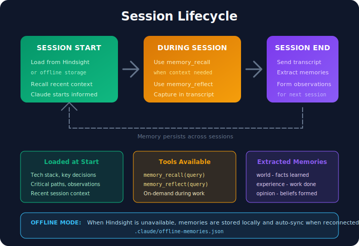
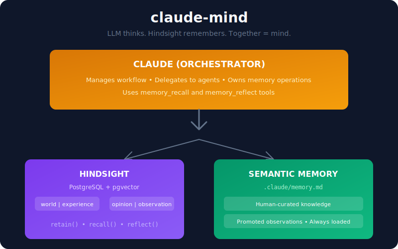

# claude-cognitive

Persistent memory for Claude Code, powered by [Hindsight](https://github.com/vectorize-io/hindsight).

**LLM thinks. Hindsight remembers. Together = mind.**

Claude's context clears after each session. claude-cognitive gives Claude persistent memory across sessions - it remembers what it learned, what it did, and forms opinions about your codebase over time.

---

## Quick Start

```bash
# Install globally
npm install -g claude-cognitive

# Interactive setup (recommended)
cd /path/to/your/project
claude-cognitive install

# Or manual setup
claude-cognitive init      # Create config
claude-cognitive learn     # Bootstrap memory
```

The interactive installer will:
- Configure memory bank and disposition
- Set up MCP server for Claude Code
- Inject memory instructions into CLAUDE.md
- Optionally bootstrap from your codebase

```bash
# Check status
claude-cognitive status

# Uninstall from a project
claude-cognitive uninstall --delete-bank
```

---

## How It Works



### Core Operations

| Operation | What It Does |
|-----------|--------------|
| **retain** | Store memories with automatic extraction (what, when, where, who, why) |
| **recall** | 4-way parallel search: semantic + keyword + graph + temporal |
| **reflect** | Reason through the bank's disposition, form opinions |
| **learn** | Bootstrap memory from existing codebase (solves cold start) |

### Memory Types

| Type | Purpose | Example |
|------|---------|---------|
| `world` | Facts about the codebase | "Auth uses Supabase magic links" |
| `experience` | What Claude did | "I fixed the redirect by moving AuthProvider" |
| `opinion` | Beliefs with confidence | "This codebase prefers explicit patterns" (0.85) |
| `observation` | Cross-session insights | "Auth changes require navigation updates" |

---

## Architecture



### Two Memory Layers

| Layer | Storage | Purpose |
|-------|---------|---------|
| **Hindsight** | PostgreSQL + pgvector | All memories, entity graphs, 4-way retrieval, opinions |
| **Semantic** | `.claude/memory.md` | Human-curated knowledge, promoted observations |

---

## MCP Tools

When running as an MCP server, Claude has access to:

### memory_recall

Search project memories for relevant context.

```
Claude: "I remember we had issues with auth redirects..."
→ memory_recall({ query: "auth redirect issues" })
```

### memory_reflect

Reason about accumulated knowledge, form opinions.

```
Claude: "What patterns have I noticed about error handling?"
→ memory_reflect({ query: "error handling patterns" })
```

---

## CLI Commands

```bash
claude-cognitive init                   # Initialize for project
claude-cognitive serve                  # Start MCP server
claude-cognitive status                 # Show connection status
claude-cognitive learn                  # Bootstrap from codebase
claude-cognitive learn --depth full     # Full analysis with git history
claude-cognitive recall "query"         # Search memories
claude-cognitive reflect "query"        # Reason about knowledge
claude-cognitive semantic               # Show semantic memory
claude-cognitive config                 # Show configuration
```

---

## Configuration

### .claudemindrc

```json
{
  "hindsight": {
    "host": "localhost",
    "port": 8888
  },
  "bankId": "my-project",
  "disposition": {
    "skepticism": 4,
    "literalism": 4,
    "empathy": 2
  },
  "background": "Developer assistant for a React Native app",
  "semantic": {
    "path": ".claude/memory.md"
  }
}
```

### Disposition Traits

Each memory bank has personality traits that shape how `reflect()` reasons:

| Trait | Low (1) | High (5) |
|-------|---------|----------|
| skepticism | Trusting | Questions claims |
| literalism | Flexible interpretation | Precise, literal |
| empathy | Fact-focused | Considers emotional context |

---

## Semantic Memory

The `.claude/memory.md` file contains human-curated project knowledge:

```markdown
## Tech Stack
- React Native with Expo SDK 51
- Supabase for auth and database
- NativeWind for styling

## Key Decisions
- Magic link auth for better mobile UX
- Zustand for state management

## Critical Paths
- Auth: src/lib/supabase.ts → src/providers/AuthProvider.tsx

## Observations
<!-- Promoted from Hindsight when confidence > 0.9 -->
- Auth changes often require navigation updates
```

This file is always loaded at session start and takes precedence over Hindsight memories when there are conflicts.

---

## Graceful Degradation

When Hindsight is unavailable, claude-cognitive continues working with semantic memory only:

| Operation | With Hindsight | Without Hindsight |
|-----------|----------------|-------------------|
| Session start | Full context | Semantic only |
| recall | 4-way search | Empty results |
| reflect | LLM reasoning | Error (requires Hindsight) |
| retain | Stored | Skipped |

---

## API Usage

```typescript
import { Mind } from 'claude-cognitive';

const mind = new Mind({
  projectPath: process.cwd(),
  disposition: { skepticism: 4, literalism: 4, empathy: 2 },
});

await mind.init();

// Get context at session start
const context = await mind.onSessionStart();

// Recall relevant memories
const memories = await mind.recall('authentication flow');

// Reason about knowledge
const reflection = await mind.reflect('What patterns exist?');

// Store new memory
await mind.retain('Fixed auth by moving Provider to root');

// Bootstrap from codebase
const result = await mind.learn({ depth: 'full' });
```

---

## Requirements

- **Node.js 18+**
- **[Hindsight](https://github.com/vectorize-io/hindsight)** server running (for full functionality)

Without Hindsight, claude-cognitive works in degraded mode with semantic memory only.

---

## Documentation

- **[Getting Started](./docs/getting-started.md)** - Installation and setup guide
- **[Concepts](./docs/concepts.md)** - Memory networks, operations, architecture
- **[Configuration](./docs/configuration.md)** - Full configuration reference
- **[API Reference](./docs/api-reference.md)** - Complete API documentation
- **[Performance](./docs/performance.md)** - Benchmarks and optimization

---

## Example

See the [todo-app example](./examples/todo-app/) for a complete integration.

---

## License

MIT
