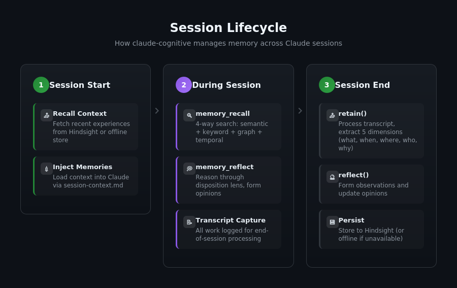
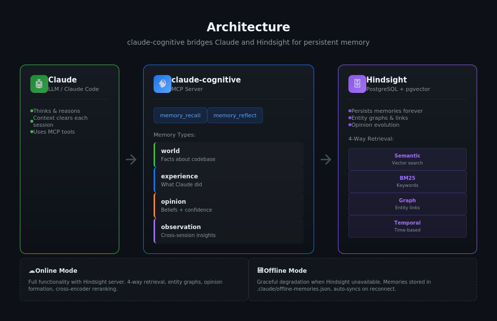

# claude-cognitive

Human-inspired memory system for Claude, powered by [Hindsight](https://github.com/vectorize-io/hindsight).

**LLM thinks. Hindsight remembers. Together = mind.**

Claude's context clears after each session. claude-cognitive gives Claude persistent memory across sessions - it remembers what it learned, what it did, and forms opinions about your codebase over time.

---

## Quick Start

```bash
# Install globally
npm install -g claude-cognitive

# Interactive setup (recommended)
cd /path/to/your/project
claude-cognitive install

# Or manual setup
claude-cognitive init      # Create config
claude-cognitive learn     # Bootstrap memory
claude-cognitive learn --depth full # Full project learn
```

The interactive installer will:

- Configure memory bank and disposition
- Set up MCP server for Claude Code
- Inject memory instructions into CLAUDE.md
- Optionally bootstrap from your codebase

```bash
# Update existing installation (recommended after upgrading)
claude-cognitive update          # Update hooks and MCP configuration
claude-cognitive update --check  # Preview changes before applying

# Check status
claude-cognitive status

# Uninstall from a project
claude-cognitive uninstall --delete-bank
```

---

## How It Works



### Core Operations

| Operation   | What It Does                                                           |
| ----------- | ---------------------------------------------------------------------- |
| **retain**  | Store memories with automatic extraction (what, when, where, who, why) |
| **recall**  | 4-way parallel search: semantic + keyword + graph + temporal           |
| **reflect** | Reason through the bank's disposition, form opinions                   |
| **learn**   | Bootstrap memory from existing codebase (solves cold start)            |

### Memory Types

| Type          | Purpose                  | Example                                          |
| ------------- | ------------------------ | ------------------------------------------------ |
| `world`       | Facts about the codebase | "Auth uses Supabase magic links"                 |
| `experience`  | What Claude did          | "I fixed the redirect by moving AuthProvider"    |
| `opinion`     | Beliefs with confidence  | "This codebase prefers explicit patterns" (0.85) |
| `observation` | Cross-session insights   | "Auth changes require navigation updates"        |

---

## Architecture



### Memory Layers

| Layer         | Storage                         | Purpose                                                |
| ------------- | ------------------------------- | ------------------------------------------------------ |
| **Hindsight** | PostgreSQL + pgvector           | All memories, entity graphs, 4-way retrieval, opinions |
| **Offline**   | `.claude/offline-memories.json` | Local storage when Hindsight unavailable (auto-syncs)  |

---

## MCP Tools

When running as an MCP server, Claude has access to:

### memory_recall

Search project memories for relevant context.

```
Claude: "I remember we had issues with auth redirects..."
→ memory_recall({ query: "auth redirect issues" })
```

### memory_reflect

Reason about accumulated knowledge, form opinions.

```
Claude: "What patterns have I noticed about error handling?"
→ memory_reflect({ query: "error handling patterns" })
```

---

## CLI Commands

```bash
claude-cognitive init                   # Initialize for project
claude-cognitive install                # Interactive setup wizard
claude-cognitive serve                  # Start MCP server
claude-cognitive status                 # Show connection status
claude-cognitive learn                  # Bootstrap from codebase
claude-cognitive learn --depth full     # Full analysis with git history
claude-cognitive recall "query"         # Search memories
claude-cognitive reflect "query"        # Reason about knowledge
claude-cognitive config                 # Show configuration
claude-cognitive update                 # Update global configuration
claude-cognitive update --check         # Check what needs updating
claude-cognitive feedback-stats         # Show feedback queue statistics
claude-cognitive feedback-sync          # Sync pending feedback signals
claude-cognitive uninstall              # Remove from project
```

> **Tip:** Use `/exit` instead of `/clear` to ensure your session syncs to Hindsight.

---

## Configuration

### .claudemindrc

```json
{
  "hindsight": {
    "host": "localhost",
    "port": 8888
  },
  "bankId": "my-project",
  "disposition": {
    "skepticism": 4,
    "literalism": 4,
    "empathy": 2
  },
  "background": "Developer assistant for a React Native app",
  "semantic": {
    "path": ".claude/memory.md"
  }
}
```

### Disposition Traits

Each memory bank has personality traits that shape how `reflect()` reasons:

| Trait      | Low (1)                 | High (5)                    |
| ---------- | ----------------------- | --------------------------- |
| skepticism | Trusting                | Questions claims            |
| literalism | Flexible interpretation | Precise, literal            |
| empathy    | Fact-focused            | Considers emotional context |

### Gemini Integration (Optional)

If you have the [Gemini CLI](https://github.com/google/gemini-cli) installed, claude-cognitive exposes additional MCP tools for deep code analysis:

| Tool | Purpose |
|------|---------|
| `gemini_analyze_code` | Security audits, quality reviews, architecture analysis |
| `gemini_research` | Deep topic research with file context |
| `gemini_summarize` | Condensing large files or content |

```json
{
  "gemini": {
    "model": "auto",
    "timeout": 0,
    "maxConcurrentRequests": 1
  }
}
```

| Option | Default | Description |
|--------|---------|-------------|
| `model` | `"auto"` | Model to use (`"auto"`, `"gemini-3-flash-preview"`, `"gemini-3-pro-preview"`) |
| `timeout` | `0` | CLI timeout in ms (0 = no timeout) |
| `maxConcurrentRequests` | `1` | Max parallel Gemini operations |

> **Note:** Gemini findings should be verified by reading actual code. Use as a starting point for exploration.

---

## Graceful Degradation & Offline Mode

When Hindsight is unavailable, claude-cognitive stores memories locally and syncs when reconnected:

| Operation     | With Hindsight | Without Hindsight (Offline)      |
| ------------- | -------------- | -------------------------------- |
| Session start | Full context   | Recent offline memories          |
| recall        | 4-way search   | Text search in offline store     |
| reflect       | LLM reasoning  | Error (requires Hindsight)       |
| retain        | Stored         | Stored offline, auto-syncs later |

**Offline storage:** `.claude/offline-memories.json`

When Hindsight becomes available again, offline memories are automatically synced and cleared.

---

## Feedback Signals

claude-cognitive automatically tracks which recalled memories are useful and submits feedback to Hindsight. This enables **query-context aware scoring** - frequently used facts rank higher in future recalls.

### How It Works

1. **Track** - Recalls are tracked during sessions
2. **Detect** - 4 detection strategies identify which facts Claude used
3. **Score** - Signals are aggregated into used/ignored verdicts
4. **Submit** - Feedback is sent to Hindsight (or queued offline)
5. **Boost** - Future recalls prioritize frequently-used facts

### Detection Strategies

| Strategy            | Confidence | Description                               |
| ------------------- | ---------- | ----------------------------------------- |
| Explicit Reference  | 0.9        | "I remember...", "As mentioned before..." |
| Semantic Similarity | 0.7        | Word overlap between response and facts   |
| File Access         | 0.4        | Fact mentions files Claude accessed       |
| Task Correlation    | 0.5        | Fact topics match completed tasks         |

### Configuration

```json
{
  "feedback": {
    "enabled": true,
    "detection": {
      "explicit": true,
      "semantic": true,
      "behavioral": true
    }
  }
}
```

### CLI Commands

```bash
claude-cognitive feedback-stats    # Show queue statistics
claude-cognitive feedback-sync     # Sync pending signals
```

See [Feedback Signals](./docs/feedback-signals.md) for full documentation.

---

## API Usage

```typescript
import { Mind } from "claude-cognitive";

const mind = new Mind({
  projectPath: process.cwd(),
  disposition: { skepticism: 4, literalism: 4, empathy: 2 },
});

await mind.init();

// Get context at session start
const context = await mind.onSessionStart();

// Recall relevant memories
const memories = await mind.recall("authentication flow");

// Reason about knowledge
const reflection = await mind.reflect("What patterns exist?");

// Store new memory
await mind.retain("Fixed auth by moving Provider to root");

// Bootstrap from codebase
const result = await mind.learn({ depth: "full" });
```

---

## Requirements

- **Node.js 18+**
- **[Hindsight](https://github.com/vectorize-io/hindsight)** server running (for full functionality)

Without Hindsight, claude-cognitive works in offline mode - memories are stored locally and automatically synced when Hindsight becomes available.

---

## Documentation

- **[Getting Started](./docs/getting-started.md)** - Installation and setup guide
- **[Concepts](./docs/concepts.md)** - Memory networks, operations, architecture
- **[Configuration](./docs/configuration.md)** - Full configuration reference
- **[API Reference](./docs/api-reference.md)** - Complete API documentation
- **[Feedback Signals](./docs/feedback-signals.md)** - Automatic usage tracking
- **[Performance](./docs/performance.md)** - Benchmarks and optimization

---

## Example

See the [todo-app example](./examples/todo-app/) for a complete integration.

---

## License

MIT
